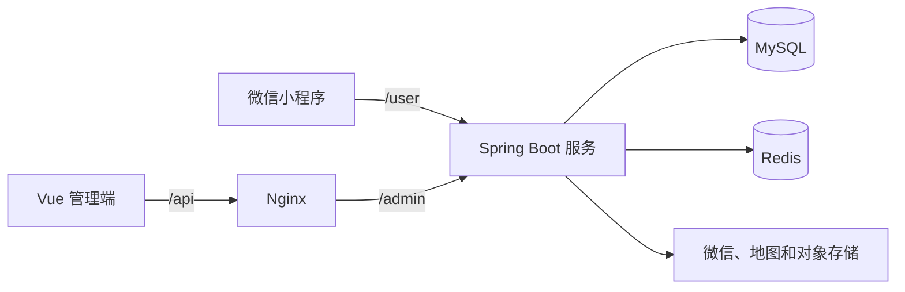
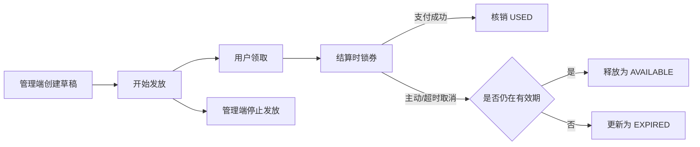

# 餐云（CloudMeal）

餐云是一个面向餐饮外卖场景的全栈点餐项目，包含 Java 后端、Vue 管理端和微信小程序端。项目在既有点餐系统基础上持续维护，当前新增内容主要集中在服务端订单计价、优惠券全链路和异常补偿。

除菜品、套餐、订单和门店营业状态等基础功能外，管理端可以创建和发放优惠券；用户领取后可在结算时使用。订单支付后核销优惠券，取消或超时后释放。支付与取消并发、超时取消长期失败等情况由条件更新、事务回滚和补偿任务处理。

> 当前版本使用演示支付，真实微信支付和已支付订单退款尚未接入。

## 实现重点

- 订单金额由服务端重新计算，用户领券和下单时分别保存金额、有效期与结算快照。
- 下单时锁券，支付成功时核销；未支付订单主动取消或超时后释放。
- 数据库条件更新决定支付与取消竞争的唯一胜者，订单和优惠券的后续更新放在同一事务中。
- 超时取消长期失败时保存独立补偿记录，按 5 分钟间隔有限重试，最终转人工处理。
- 管理端优惠券使用 `草稿 → 发放中 → 已停用` 状态机，只有草稿允许编辑和删除。
- 三端均有自动化测试；后端测试包含真实数据库事务、并发竞争和端到端补偿。

## 系统结构



## 优惠券业务流程



用户优惠券状态：

| 状态 | 含义 | 允许的下一状态 |
| --- | --- | --- |
| `AVAILABLE` | 可使用 | `LOCKED`、`EXPIRED` |
| `LOCKED` | 已绑定待付款订单 | `USED`、`AVAILABLE`、`EXPIRED` |
| `USED` | 支付成功后已核销 | 终态 |
| `EXPIRED` | 已过有效期 | 终态 |

管理端优惠券状态：

| 状态 | 可执行操作 |
| --- | --- |
| `DRAFT`（草稿） | 查看、编辑、开始发放、删除 |
| `DISTRIBUTING`（发放中） | 查看、停止发放 |
| `DISABLED`（已停用） | 查看 |

开始发放、停止发放、库存扣减、锁券、核销和释放均使用带当前状态的条件更新。并发请求即使同时读取到旧状态，也只有第一个更新者能够成功修改数据。

更完整的设计说明见 [优惠券与订单一致性设计](docs/coupon-order-consistency.md)。

## 失败补偿

强一致事务可以阻止订单和优惠券出现混合状态，但不能保证数据库异常会自行恢复。例如释放优惠券失败时，取消事务会整体回滚，订单仍保持待付款，优惠券仍保持锁定。

项目使用独立补偿任务处理这类长期失败：

1. 原业务事务失败后，通过 `REQUIRES_NEW` 独立事务记录订单、用户优惠券、失败原因和下次执行时间。
2. 补偿任务只扫描已到期的 `PENDING` 记录，并通过条件更新原子抢占为 `PROCESSING`。
3. 每次失败后间隔 5 分钟重试，最多自动补偿 3 次。
4. 连续失败后转为 `MANUAL`，避免永久异常造成无限重试和数据库压力。
5. 单条补偿失败不会中断其他订单的处理。
6. 执行节点异常退出时，长时间停留在 `PROCESSING` 的任务可重新回到待处理状态。

## 主要功能

### 用户端

- 微信登录与登录态恢复
- 菜品、分类和套餐浏览
- 购物车、地址和备注管理
- 服务端订单预览与计价
- 优惠券中心、我的优惠券和结算选券
- 下单锁券、演示支付核销、取消或超时释放
- 当前订单、历史订单和订单详情

### 管理端

- 工作台与经营数据展示
- 员工、分类、菜品和套餐管理
- 订单处理与门店营业状态管理
- 优惠券分页查询、创建、编辑和详情
- 优惠券开始发放、停止发放和草稿删除

## 技术栈

| 模块 | 技术 |
| --- | --- |
| 后端 | Java、Spring Boot 2.7.3、Spring MVC、Spring Transaction |
| 数据访问 | MyBatis-Plus 3.5.17、MyBatis XML、PageHelper、Druid |
| 数据与缓存 | MySQL、Redis |
| 身份认证 | JWT、登录上下文隔离 |
| 管理端 | Vue 2.6、TypeScript、Element UI、Axios、Vuex |
| 小程序 | UniApp、Vue、微信小程序运行代码 |
| 测试 | JUnit 5、Mockito、Spring Boot Test、Jest、Node Test Runner |
| 部署辅助 | Nginx、Maven、PowerShell |

## 目录说明

```text
canyun/
├─ houduan/               Java 后端多模块 Maven 工程
│  ├─ sky-common/         公共配置、异常、工具和通用结果
│  ├─ sky-pojo/           DTO、实体和 VO
│  ├─ sky-server/         Controller、Service、Mapper、任务与测试
│  └─ sql/coupon.sql      优惠券与补偿相关数据库迁移
├─ wangye/                Vue 管理端源码
├─ xiaochengxu-source/    可维护的 UniApp 小程序源码
├─ xiaochengxu/           微信开发者工具直接打开的编译结果
├─ tests/miniapp/         小程序业务与发布流程测试
├─ scripts/               小程序编译结果同步脚本
├─ nginx-1.20.2/conf/     项目使用的 Nginx 配置
└─ docs/                  业务设计文档
```

小程序功能应优先修改 `xiaochengxu-source`，编译后再通过同步脚本更新 `xiaochengxu`。`xiaochengxu/project.private.config.json` 属于本地私有配置，不进入版本控制。

## 本地运行

### 1. 环境准备

建议准备：

- JDK 17（项目基于 Spring Boot 2.7.3）
- Maven 3.8+
- MySQL 8.x
- Redis
- Node.js 12.22（运行管理端旧版 Vue CLI）
- Node.js 20+（运行小程序的 Node Test Runner 测试，可通过版本管理工具切换）
- 微信开发者工具；修改小程序源码时建议使用 HBuilderX

### 2. 初始化数据库

仓库当前聚焦增量业务代码与迁移脚本，不包含基础业务表的完整建库脚本。

1. 先准备与当前实体类和 Mapper 结构匹配的基础业务库。
2. 选择目标数据库。
3. 执行 `houduan/sql/coupon.sql`，创建优惠券、用户优惠券、补偿任务表，并为订单补充金额快照字段。

脚本使用 `CREATE TABLE IF NOT EXISTS` 和 `information_schema` 判断，避免重复创建已经存在的字段和索引。正式执行前仍建议备份数据库。

### 3. 配置后端

在 `houduan/sky-server/src/main/resources/` 下创建本地 `application-dev.yml`。该文件已被 `.gitignore` 排除，请勿提交真实密钥。

```yaml
sky:
  datasource:
    driver-class-name: com.mysql.cj.jdbc.Driver
    host: localhost
    port: 3306
    database: your_database
    username: your_username
    password: your_password
  redis:
    host: localhost
    port: 6379
    database: 0
  wechat:
    appid: your_wechat_appid
    secret: your_wechat_secret
  alioss:
    endpoint: your_oss_endpoint
    access-key-id: your_access_key_id
    access-key-secret: your_access_key_secret
    bucket-name: your_bucket_name
  baidu-map:
    ak: your_ak
    sk: your_sk
    shop-address: your_shop_address
```

不需要测试的第三方能力也应使用本地占位配置，不能把真实密钥提交到仓库。

### 4. 启动后端

可以在 IDE 中运行：

```text
com.sky.SkyApplication
```

也可以在 `houduan` 目录构建并运行：

```powershell
mvn -pl sky-server -am package -DskipTests
java -jar sky-server/target/sky-server-1.0-SNAPSHOT.jar
```

后端默认端口为 `8080`。

### 5. 启动管理端

```powershell
cd wangye
npm install
$env:VUE_APP_URL = "http://localhost:8080/admin"
npm run serve
```

管理端开发服务器默认使用 `8090`。项目附带的 Nginx 配置也监听 `8090`，本地调试时只能启动其中一个，或者修改一方端口。生产构建命令为：

```powershell
npm run build
```

生产环境可使用 `nginx-1.20.2/conf/nginx.conf` 作为参考，将 `/api/` 转发到后端 `/admin/`。

### 6. 启动小程序

- 直接调试当前编译结果：使用微信开发者工具打开 `xiaochengxu`。
- 修改源码：使用 HBuilderX 打开 `xiaochengxu-source`，编译目标选择微信小程序。
- 本地模拟器默认请求 `http://localhost:8080`，配置位于 `xiaochengxu-source/utils/env.js`。
- 真机调试时需要将地址改为电脑的局域网地址，并配置微信开发者工具的合法域名策略。

编译完成后，可在仓库根目录同步运行代码：

```powershell
powershell -ExecutionPolicy Bypass -File scripts/sync-miniapp-output.ps1
```

同步脚本会保留微信项目配置，并在替换失败时尝试恢复旧版本。

## 测试

当前功能分支最近一次完整验证结果：

| 范围 | 结果 |
| --- | --- |
| Java 后端 | 96 个测试通过 |
| Vue 管理端 | 53 个测试通过 |
| 微信小程序 | 114 个测试通过 |

后端测试：

```powershell
cd houduan
mvn -pl sky-server -am test
```

管理端测试：

```powershell
cd wangye
npm run test:unit -- --runInBand
```

小程序测试（仓库根目录）：

```powershell
$tests = Get-ChildItem -LiteralPath tests/miniapp -Filter *.test.cjs | ForEach-Object FullName
node --test $tests
```

优惠券相关测试覆盖：并发重复领取、库存原子扣减、服务端计价、锁券、核销、释放、支付与取消竞争、事务回滚、补偿任务抢占、有限重试、人工兜底和真实数据库端到端流程。

## 当前限制

- 当前支付是演示支付，尚未完成真实微信支付联调。
- 已支付订单退款链路尚未实现。
- 仓库不包含基础业务表的完整数据库初始化脚本。
- 第三方服务密钥必须通过本地配置提供，不能提交到 Git。
- 管理端生产静态文件和本地 Nginx 运行目录不会进入版本控制。

## 后续计划

下一阶段计划实现餐饮 AI 客服，目标包括：

- 基于项目业务知识回答营业时间、配送、取消退款和优惠券规则。
- 根据口味、预算和忌口推荐真实菜品，价格与库存通过后端受控查询获取。
- 在登录态下查询当前用户的订单和优惠券，不接收前端任意指定的用户 ID。
- 结合 RAG 与 Tool Calling，降低模型幻觉和越权查询风险。
- 补充会话管理、提示注入防护、限流、日志和评估测试。

以上 AI 能力尚未实现，当前仅作为后续技术规划。
